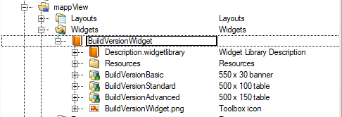

# Build Version Widget Library

This package serves a widget library to be paired with the [BuildVersion](../BuildVersionTask/index.md) PowerShell script package.  
BuildVersion is a software package for Automation Studio to automatically collect version information from a git repository.  
This widget library provides single binding widgets to quickly display a range of git version information.  

!!! notice tips "Note"
	This is not an official package and is provided as-in under the GPL v3.0 license.

## Features

- Single structure binding
	- Users can simply use the existing structure defined in [BuildVersion](../BuildVersionTask/index.md)
- Multiple compound widgets
	- Basic
	- Standard
	- Advanced
- Change warning indicator
	- Notify users when uncommitted changes are detected

## Widgets



!!! notice tips "Note"
	The warning icon appears to notify the user when the git repository has uncomitted changes.

### Basic


### Standard


### Advanced


## Binding

A single binding is required to populate the widgets with build information.  
Use the [BuildVersion](../BuildVersionTask/index.md) package with includes a task and variable to bind with `::BuildVer:BuildVersion`.

```xml
<Binding mode="oneWay">
  <Source xsi:type="opcUaComplexObject" refId="::BuildVer:BuildVersion" />
  <Target xsi:type="brease" contentRefId="content_0" widgetRefId="BuildVersionStandard1" attribute="value" />
</Binding>
```
